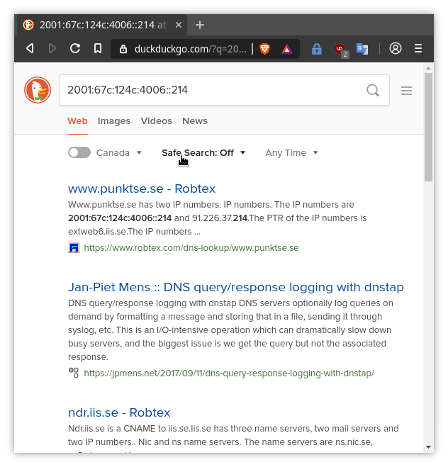
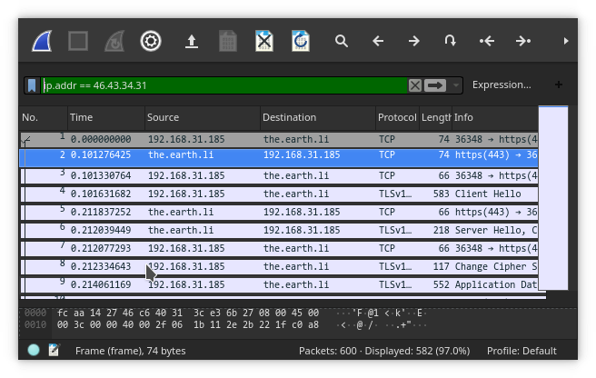
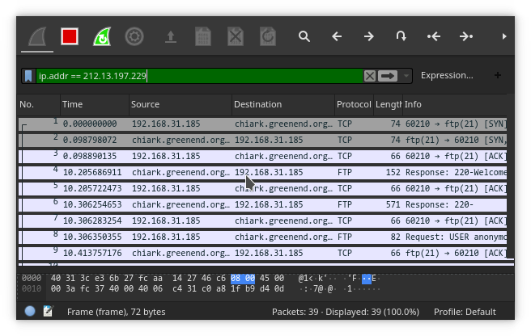
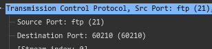
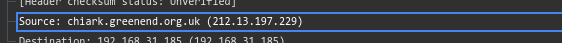

# Part 1: Network and Server Discovery

 + What is the IP address of the server?  
    130.63.236.137
 + Open a browser session and paste the IP address in the address bar of the browser, document the output using a screen snapshot.  
    {height=3in}
 + What is the source of the server that performed resolution of whois utility?  
    whois.arin.net
 + What is the network name?  
    YORKU
 + What is the Organization's name?  
    York University (YORKUN)
 + From the Tools menu, select Nslookup and specify www.yorku.ca for the hostname and select All for Query type.  
   - What type of records does the server has (A or AAAA)?  
     A and CNAME
   - What is the IP address of the server?  
     130.63.236.137
   - Attempt to browse the home page of the server using its IP
   address and document the output using a screen snapshot.  
     {height=3in}
   - What is the 1st domain server’s name?  
     dns11.ipns.yorku.ca (for yorku.ca)
   - What is the 2nd domain server’s name?  
     dns21.ipns.yorku.ca (for yorku.ca)

 + From the Tools menu, select Nslookup and specify www.iis.se for the host name and select All for Query Type.  
   - What type of records does the server has?  
     A and AAAA
   - What is/are the IP address of the server?  
     * 91.226.37.214  
     * 2001:67c:124c:4006::214
   
   - Attempt to browse the home page of the server using its IP
   addresses IPv4 and IPv6 and document the output using a screen
   snapshot.  
   {height=3in} 
   {height=3in}

   - Reattempt to brows the home page using [IPv6], you should
   include the IPv6 in the brackets in the address bar of the browser.   
     {height=3in}
   - What is the 1st domain server’s name?  
     ns3.nic.se
   - What is the 2nd domain server’s name?  
     i.ns.se
   - Test connectivity to the server using the Ping utility and IPv6.

           % ping -6 2001:67c:124c:4006::214
           PING 2001:67c:124c:4006::214(2001:67c:124c:4006::214) 56 data bytes
           64 bytes from 2001:67c:124c:4006::214: icmp_seq=1 ttl=54 time=144 ms
           64 bytes from 2001:67c:124c:4006::214: icmp_seq=2 ttl=54 time=144 ms
           64 bytes from 2001:67c:124c:4006::214: icmp_seq=3 ttl=54 time=142 ms
           64 bytes from 2001:67c:124c:4006::214: icmp_seq=4 ttl=54 time=133 ms
           ^C
           --- 2001:67c:124c:4006::214 ping statistics ---
           5 packets transmitted, 4 received, 20% packet loss, time 9ms
           rtt min/avg/max/mdev = 133.233/141.008/144.485/4.604 ms

 + Using the resource https://tools.keycdn.com/geo,   
   - Find the geographical location of the server www.yorku.ca by name and by IPv4.
       a. What is the host name? cns.yorku.ca
       b. What is AS number of the network? 802
       c. What are the city, country, continent, and latitude/longitude coordinates values?  
         Toronto, Canada  
         North America  
         43.7694,-79.4921  

   - Find the geographical location of the server www.iis.se by the server name, IPv4, and IPv6.  
       a. What is the host name? extweb6.iis.se
       b. What is AS number of the network? 197564
       c. What are the city, country, continent, and latitude/longitude coordinates values?  Stolkholm, Sweden, Europe, 59.3333,18.05

 + Using the resource https://network-tools.com/, select HTTP Headers and specify the server name yorku.ca as the server name.  
   - What is the HTTP protocol version running on the server?  
   HTTP/1.1
   - What type of web server is running on the server?  
   Apache 2.4.29
   - What type of operating system is running on the server?  
   Ubuntu Linux
   - Has the server reported any error messages? If so, search the code and attempt to interpret its meaning?  
   302 Found; An informational message suggesting redirection.
 + Using the resource https://network-tools.com/, select HTTP Headers and specify the server name www.iis.se as the server name.  
   - What is the HTTP protocol version running on the server?  
   HTTP/1.1
   - What type of web server is running on the server?  
   Apache 2.4.7
   - What type of operating system is running on the server?  
   Ubuntu Linux
   - Has the server reported any error messages? If so, search the code and attempt to interpret its meaning?  
   301 Moved Permanently; An informational message indicating the content has been permanantly moved.
   - Re-attempt requesting the headers using https://www.iis.se instead of www.iis.se; has the server reported any messages; if so, what is the message code?  
   200 OK, Not an error message.

# Part 2: Packet Analysis

## HTTP Demonstration: Download the PuTTY for Telnet using Hypertext Transfer Protocol

 - From the hyper link extract the URI for the putty
server: 
    https://the.earth.li/~sgtatham/putty/latest/w32/puttytel.exe
 - Ping the extracted URL. 

        % ping 'https://the.earth.li/~sgtatham/putty/latest/w32/puttytel.exe'
        ping: https://the.earth.li/~sgtatham/putty/latest/w32/puttytel.exe: Name or service not known
        % ping -c 4 'the.earth.li'
        PING the.earth.li (46.43.34.31) 56(84) bytes of data.
        64 bytes from the.earth.li (46.43.34.31): icmp_seq=1 ttl=47 time=134 ms
        64 bytes from the.earth.li (46.43.34.31): icmp_seq=2 ttl=47 time=105 ms
        64 bytes from the.earth.li (46.43.34.31): icmp_seq=3 ttl=47 time=103 ms
        64 bytes from the.earth.li (46.43.34.31): icmp_seq=4 ttl=47 time=100 ms
        
        --- the.earth.li ping statistics ---
        4 packets transmitted, 4 received, 0% packet loss, time 7ms
        rtt min/avg/max/mdev = 100.429/110.816/134.490/13.790 msu

 - Identify the IP address of the pinged server: 46.43.34.31
 - Identify the port number of the server: 443  
 {height=24pt}
 - Using the filter dialog box, extract the frames that includes the IP address that you have identified in step 1.10 (above):  
 {height=2in}

## FTP Demonstration: Download the PuTTY for Telnet utility using File Transfer Protocol

 - From the hyper link extract the URL for the putty
server: ftp://ftp.chiark.greenend.org.uk/users/sgtatham/putty-latest/w32/puttytel.exe
 - Ping the extracted URL.

        % ping 'ftp://ftp.chiark.greenend.org.uk/users/sgtatham/putty-latest/w32/puttytel.exe'
        ping: ftp://ftp.chiark.greenend.org.uk/users/sgtatham/putty-latest/w32/puttytel.exe: Name or service not known
        % ping -c4 'ftp.chiark.greenend.org.uk'                                         
        PING service-name.chiark.greenend.org.uk (212.13.197.229) 56(84) bytes of data.
        64 bytes from chiark.greenend.org.uk (212.13.197.229): icmp_seq=1 ttl=50 time=107 ms
        64 bytes from chiark.greenend.org.uk (212.13.197.229): icmp_seq=2 ttl=50 time=102 ms
        64 bytes from chiark.greenend.org.uk (212.13.197.229): icmp_seq=3 ttl=50 time=113 ms
        64 bytes from chiark.greenend.org.uk (212.13.197.229): icmp_seq=4 ttl=50 time=97.8 ms
        
        --- service-name.chiark.greenend.org.uk ping statistics ---
        4 packets transmitted, 4 received, 0% packet loss, time 6ms
        rtt min/avg/max/mdev = 97.805/105.151/113.065/5.677 ms

 - Identify the assigned IP address of the pinged server: 212.13.197.229
 - Display the segment of frames for that particular IP using the WireShark captured data  
    {height=2in}
 - Demonstrate the port number of the server: 21  
   
 - Identify the IP address of the server using Wireshark:  
   

