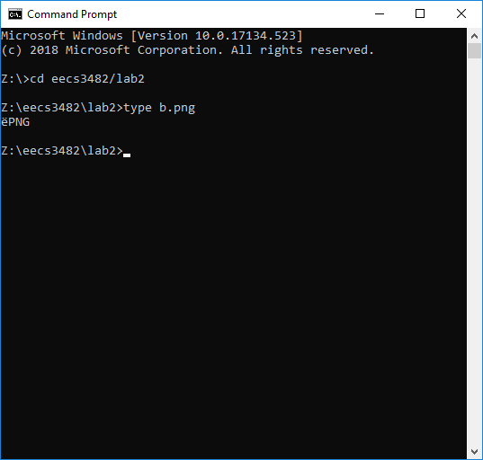
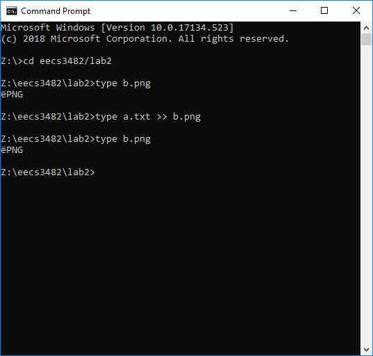
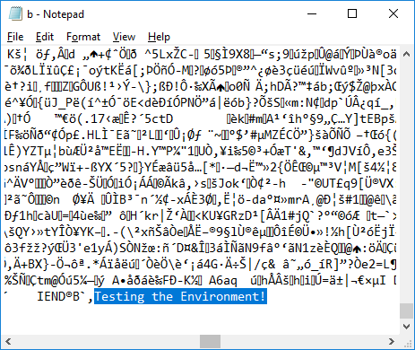

# Part 1: Telnet And SSH Connections Analysis

## Bandit

The following is a solution to Bandit part 1-9 in the form of a shell script. It uses the `sshpass` program to allow `ssh` to accept a password non-interactively.

    #!/bin/sh
    HOST=bandit.labs.overthewire.org
    PASSWORD=bandit0
    NUM=0
    while read -r COMMAND; do
        USERNAME=bandit$NUM
        echo running $USERNAME: $COMMAND
        PASSWORD=$(sshpass -p $PASSWORD ssh -tp 2220 $USERNAME@$HOST $COMMAND < /dev/zero 2>/dev/zero)
        echo $PASSWORD
        NUM=$(expr $NUM + 1)
    done << EOF
    cat ./readme
    cat ./-
    cat ./spaces\ in\ this\ filename
    cat ./inhere/.hidden
    sh -c "file ./inhere/* | fgrep text | cut -d: -f1 | xargs cat"
    sh -c 'find ./inhere -size 1033c \! -executable | xargs file | fgrep text | cut -d: -f1 | xargs cat'
    sh -c 'find / -size 33c -user bandit7 -group bandit6 | xargs cat'
    sh -c 'fgrep millionth data.txt | cut -f2'
    sh -c 'sort data.txt | uniq -u'
    sh -c "strings data.txt | grep -o '[a-zA-Z0-9]\{32\}'"
    echo hello from level 10
    EOF

The following is the password to level 10, as retrieved from the output of the script:

    truKLdjsbJ5g7yyJ2X2R0o3a5HQJFuLk

## Telnet

## SSH

# Phish

# Steg
## Windows

1. Using the Notepad, create a text file and insert the following line:

       Testing the Environment!
   
   Save the file as a.txt

2. Download the attached image file (b.png) to the same directory of the text file.

3. Parse the file using an image reader and document the output.

     
   Windows Photos views the PNG.

4. Attempt to read the file using the command: type b.png -> Document the output.

   
     
   `type` prints the PNG header.

5. On the command prompt run the following command: type a.txt >> b.png.

6. Parse the file using an image reader and document the output.

     
   Windows Photos still views the PNG as if nothing has changed. 

7. Attempt to read the file using the command: type b.png -> Document the output.

     
   `type` prints the PNG header, but not what we catenated to the end of the file.

8. Using a notepad session, open the file b.png and scroll down to the end file, document what you see.

     
   The contents of a.txt is visible at the end of the file.
