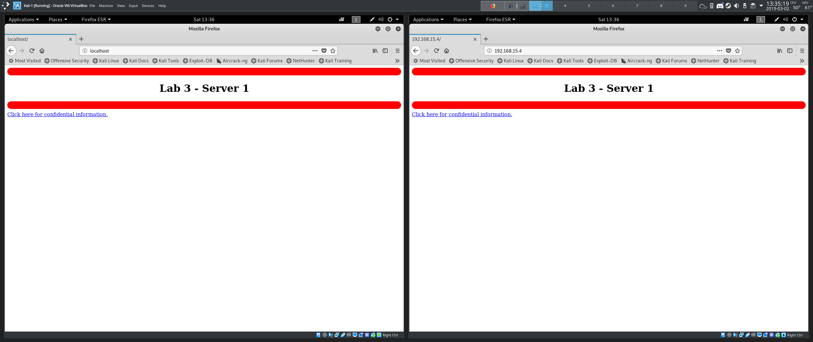
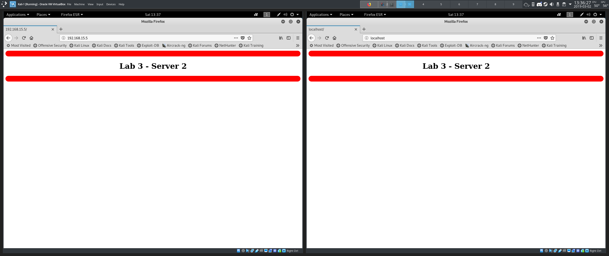
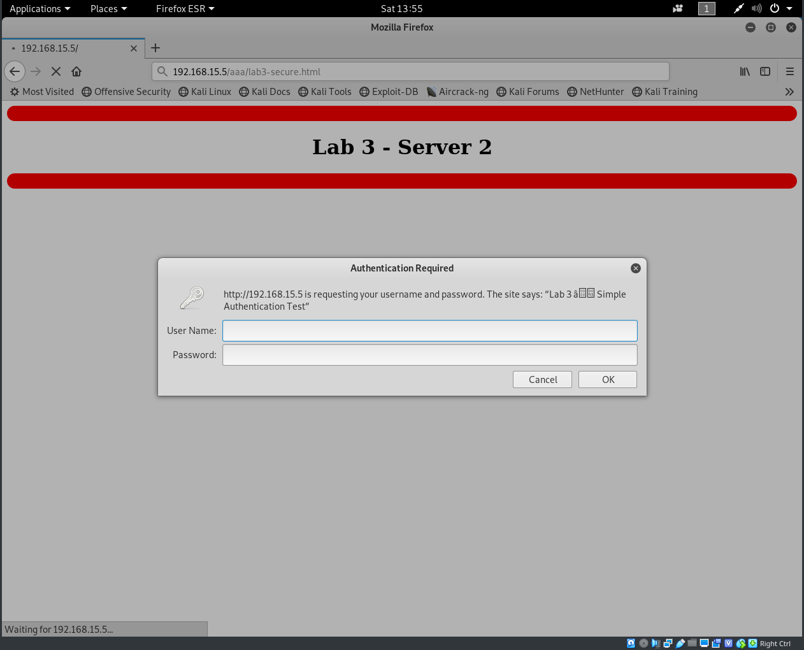
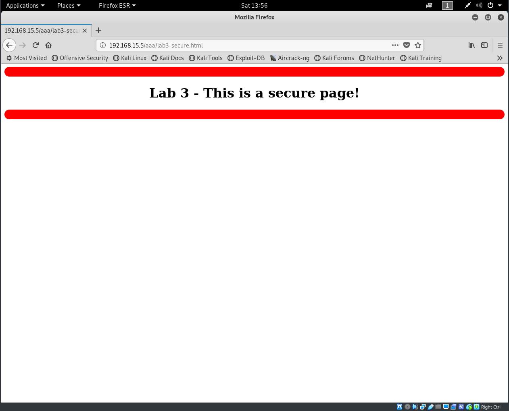

# Pre-lab Procedures

## Determine the current IPv4 address for both servers.

- Kali-1 IPv4: 192.168.15.4
- Kali-2 IPv4: 192.168.15.5

## What is the IPv4 address of the default gateway router?

- Gateway: 192.168.15.1

## What is the purpose of the metric field for each route?

- Metric: used to quantify the "quality" of routes. Lower metric -> higher quality -> higher priority

## Document the results of:
- Pinging the servers 1-to-2 and 2-to-1
- Pinging the default gateway
- Output of the command `traceroute yorku.ca` from both servers.

### Ping from Kali-1 to Kali-2:
```
PING 192.168.15.5 (192.168.15.5) 56(84) bytes of data.
64 bytes from 192.168.15.5: icmp_seq=1 ttl=64 time=0.288 ms
64 bytes from 192.168.15.5: icmp_seq=2 ttl=64 time=0.212 ms
64 bytes from 192.168.15.5: icmp_seq=3 ttl=64 time=0.351 ms
64 bytes from 192.168.15.5: icmp_seq=4 ttl=64 time=0.252 ms

--- 192.168.15.5 ping statistics ---
4 packets transmitted, 4 received, 0% packet loss, time 52ms
rtt min/avg/max/mdev = 0.212/0.275/0.351/0.054 ms
```

### Ping from Kali-1 to the gateway
```
PING 192.168.15.1 (192.168.15.1) 56(84) bytes of data.
64 bytes from 192.168.15.1: icmp_seq=1 ttl=255 time=0.138 ms
64 bytes from 192.168.15.1: icmp_seq=2 ttl=255 time=0.185 ms
64 bytes from 192.168.15.1: icmp_seq=3 ttl=255 time=0.177 ms
64 bytes from 192.168.15.1: icmp_seq=4 ttl=255 time=0.151 ms

--- 192.168.15.1 ping statistics ---
4 packets transmitted, 4 received, 0% packet loss, time 70ms
rtt min/avg/max/mdev = 0.138/0.162/0.185/0.024 ms
```

### Traceroute from Kali-1
```
traceroute to yorku.ca (130.63.236.137), 30 hops max, 60 byte packets
 1  _gateway (192.168.15.1)  0.146 ms  0.119 ms  0.103 ms
 2  * * *
 3  * * *
 4  * * *
 5  * * *
 6  * * *
 7  * * *
 8  * * *
 9  * * *
10  * * *
11  * * *
12  * * *
13  * * *
14  * * *
15  * * *
16  * * *
17  * * *
18  * * *
19  * * *
20  * * *
21  * * *
22  * * *
23  * * *
24  * * *
25  * * *
26  * * *
27  * * *
28  * * *
29  * * *
30  * * *
```

### Ping from Kali-2 to Kali-1:
```
PING 192.168.15.4 (192.168.15.4) 56(84) bytes of data.
64 bytes from 192.168.15.4: icmp_seq=1 ttl=64 time=0.311 ms
64 bytes from 192.168.15.4: icmp_seq=2 ttl=64 time=0.304 ms
64 bytes from 192.168.15.4: icmp_seq=3 ttl=64 time=0.311 ms
64 bytes from 192.168.15.4: icmp_seq=4 ttl=64 time=0.338 ms

--- 192.168.15.4 ping statistics ---
4 packets transmitted, 4 received, 0% packet loss, time 76ms
rtt min/avg/max/mdev = 0.304/0.316/0.338/0.013 ms
```

### Ping from Kali-2 to the gateway:
```
PING 192.168.15.1 (192.168.15.1) 56(84) bytes of data.
64 bytes from 192.168.15.1: icmp_seq=1 ttl=255 time=0.199 ms
64 bytes from 192.168.15.1: icmp_seq=2 ttl=255 time=0.156 ms
64 bytes from 192.168.15.1: icmp_seq=3 ttl=255 time=0.184 ms
64 bytes from 192.168.15.1: icmp_seq=4 ttl=255 time=0.258 ms

--- 192.168.15.1 ping statistics ---
4 packets transmitted, 4 received, 0% packet loss, time 63ms
rtt min/avg/max/mdev = 0.156/0.199/0.258/0.038 ms
```

#### Traceroute from Kali-2
```
traceroute to yorku.ca (130.63.236.137), 30 hops max, 60 byte packets
 1  _gateway (192.168.15.1)  0.052 ms  0.035 ms  0.036 ms
 2  * * *
 3  * * *
 4  * * *
 5  * * *
 6  * * *
 7  * * *
 8  * * *
 9  * * *
10  * * *
11  * * *
12  * * *
13  * * *
14  * * *
15  * * *
16  * * *
17  * * *
18  * * *
19  * * *
20  * * *
21  * * *
22  * * *
23  * * *
24  * * *
25  * * *
26  * * *
27  * * *
28  * * *
29  * * *
30  * * *
```

# Part 1: Apache Basic Authentication

### Test the servers status in the browser using the address localhost.

Success! They show the Debian Apache 2 Default Page.

### Kali-1 Server from Kali-1 and Kali-2.



### Kali-2 Server from Kali-1 and Kali-2.



### List the files stored in the directory `/etc/apache2/sites-enabled`.

- `000-default.conf`
- `001-secure.conf`

### List the files stored in `/etc/apache2`.

- `apache2.conf`
- `conf-available`
- `conf-enabled`
- `envvars`
- `.htaccess`
- `magic`
- `mods-available`
- `mods-enabled`
- `ports.conf`
- `sites-available`
- `sites-enabled`

### Document the contents of the `.htaccess` file.

The file contains the username and a digest of the password, delimited by a colon.

### View the secure file stored on Kali-2 from Kali-1.

 

# Part 2: HTTPS

- We can connect to the server successfully via OpenSSL, but are warned about the self-signed certificate.
- Firefox refuses to connect without adding an exception.

### Display the cipher list:

- `TLS_AES_256_GCM_SHA384`
- `TLS_CHACHA20_POLY1305_SHA256`
- `TLS_AES_128_GCM_SHA256`
- `ECDHE-ECDSA-AES256-GCM-SHA384`
- `ECDHE-RSA-AES256-GCM-SHA384`
- `DHE-RSA-AES256-GCM-SHA384`
- `ECDHE-ECDSA-CHACHA20-POLY1305`
- `ECDHE-RSA-CHACHA20-POLY1305`
- `DHE-RSA-CHACHA20-POLY1305`
- `ECDHE-ECDSA-AES128-GCM-SHA256`
- `ECDHE-RSA-AES128-GCM-SHA256`
- `DHE-RSA-AES128-GCM-SHA256`
- `ECDHE-ECDSA-AES256-SHA384`
- `ECDHE-RSA-AES256-SHA384`
- `DHE-RSA-AES256-SHA256`
- `ECDHE-ECDSA-AES128-SHA256`
- `ECDHE-RSA-AES128-SHA256`
- `DHE-RSA-AES128-SHA256`
- `ECDHE-ECDSA-AES256-SHA`
- `ECDHE-RSA-AES256-SHA`
- `DHE-RSA-AES256-SHA`
- `ECDHE-ECDSA-AES128-SHA`
- `ECDHE-RSA-AES128-SHA`
- `DHE-RSA-AES128-SHA`
- `RSA-PSK-AES256-GCM-SHA384`
- `DHE-PSK-AES256-GCM-SHA384`
- `RSA-PSK-CHACHA20-POLY1305`
- `DHE-PSK-CHACHA20-POLY1305`
- `ECDHE-PSK-CHACHA20-POLY1305`
- `AES256-GCM-SHA384`
- `PSK-AES256-GCM-SHA384`
- `PSK-CHACHA20-POLY1305`
- `RSA-PSK-AES128-GCM-SHA256`
- `DHE-PSK-AES128-GCM-SHA256`
- `AES128-GCM-SHA256`
- `PSK-AES128-GCM-SHA256`
- `AES256-SHA256`
- `AES128-SHA256`
- `ECDHE-PSK-AES256-CBC-SHA384`
- `ECDHE-PSK-AES256-CBC-SHA`
- `SRP-RSA-AES-256-CBC-SHA`
- `SRP-AES-256-CBC-SHA`
- `RSA-PSK-AES256-CBC-SHA384`
- `DHE-PSK-AES256-CBC-SHA384`
- `RSA-PSK-AES256-CBC-SHA`
- `DHE-PSK-AES256-CBC-SHA`
- `AES256-SHA`
- `PSK-AES256-CBC-SHA384`
- `PSK-AES256-CBC-SHA`
- `ECDHE-PSK-AES128-CBC-SHA256`
- `ECDHE-PSK-AES128-CBC-SHA`
- `SRP-RSA-AES-128-CBC-SHA`
- `SRP-AES-128-CBC-SHA`
- `RSA-PSK-AES128-CBC-SHA256`
- `DHE-PSK-AES128-CBC-SHA256`
- `RSA-PSK-AES128-CBC-SHA`
- `DHE-PSK-AES128-CBC-SHA`
- `AES128-SHA`
- `PSK-AES128-CBC-SHA256`
- `PSK-AES128-CBC-SHA`

### List the security levels of OpenSSL and describe how they differ

Changing the security level changes which algorithms are allowed - higher security levels enforce stronger algorithms.

- Level 0: Everything is permitted.
- Level 1: Minimum 80 bits of security. SSLv2 prohibited, MD5 prohibited.
- Level 2: Minimum 112 bits of security. SSLv3 prohibited. RC4 prohibited.
- Level 3: Minimum 128 bits of security. TLS below 1.1 prohibited. Session tickets disabled.
- Level 4: Minimum 192 bits of security. TLS below 1.2 prohibited. SHA1 prohibited.
- Level 5: Minimum 256 bits of security. 

### Using the examples listed on `pkeyutl` man page -> create the text file `h.txt` that contains the word `HELLO` and sign the file using the private key.

    # echo HELLO > h.txt
    # openssl pkeyutl -sign -in h.txt -inkey /etc/apache2/ssl/apache.key -out sig
    # openssl pkeyutl -verifyrecover -in sig -inkey /etc/apache2/ssl/apache.key 
    HELLO
    # openssl pkeyutl -verifyrecover -in sig -inkey /etc/apache2/ssl/apache.key
    HELLO
    # openssl pkeyutl -verify -in h.txt -sigfile sig -inkey /etc/apache2/ssl/apache.key 
    Signature Verified Successfully

### Run the following commands and document the output

```
# openssl list -cipher-algorithms
AES-128-CBC
AES-128-CBC-HMAC-SHA1
AES-128-CBC-HMAC-SHA256
id-aes128-CCM
AES-128-CFB
AES-128-CFB1
... # many more cipher algorithms follow
# openssl list -public-key-algorithms
Name: OpenSSL RSA method
	Type: Builtin Algorithm
	OID: rsaEncryption
	PEM string: RSA
Name: rsa
	Alias for: rsaEncryption
Name: OpenSSL PKCS#3 DH method
	Type: Builtin Algorithm
	OID: dhKeyAgreement
	PEM string: DH
... # many more public key algorithms follow
# openssl list -digest-commands

blake2b512        blake2s256        gost              md4               
md5               rmd160            sha1              sha224            
sha256            sha384            sha512            
# openssl speed sha256 aes-256-cbc
Doing sha256 for 3s on 16 size blocks: 16628149 sha256's in 2.96s
Doing sha256 for 3s on 64 size blocks: 9507998 sha256's in 2.96s
Doing sha256 for 3s on 256 size blocks: 4066390 sha256's in 3.00s
Doing sha256 for 3s on 1024 size blocks: 1295427 sha256's in 3.00s
Doing sha256 for 3s on 8192 size blocks: 172836 sha256's in 3.01s
Doing sha256 for 3s on 16384 size blocks: 88731 sha256's in 3.00s
Doing aes-256 cbc for 3s on 16 size blocks: 22957166 aes-256 cbc's in 3.00s
Doing aes-256 cbc for 3s on 64 size blocks: 6165145 aes-256 cbc's in 3.00s
Doing aes-256 cbc for 3s on 256 size blocks: 1570503 aes-256 cbc's in 3.01s
Doing aes-256 cbc for 3s on 1024 size blocks: 889688 aes-256 cbc's in 3.00s
Doing aes-256 cbc for 3s on 8192 size blocks: 113405 aes-256 cbc's in 3.01s
Doing aes-256 cbc for 3s on 16384 size blocks: 56555 aes-256 cbc's in 3.00s
OpenSSL 1.1.1a  20 Nov 2018
built on: Thu Nov 22 18:40:54 2018 UTC
options:bn(64,64) rc4(16x,int) des(int) aes(partial) blowfish(ptr) 
compiler: gcc -fPIC -pthread -m64 -Wa,--noexecstack -Wall -Wa,--noexecstack -g -O2 -fdebug-prefix-map=/build/openssl-9jbgLq/openssl-1.1.1a=. -fstack-protector-strong -Wformat -Werror=format-security -DOPENSSL_USE_NODELETE -DL_ENDIAN -DOPENSSL_PIC -DOPENSSL_CPUID_OBJ -DOPENSSL_IA32_SSE2 -DOPENSSL_BN_ASM_MONT -DOPENSSL_BN_ASM_MONT5 -DOPENSSL_BN_ASM_GF2m -DSHA1_ASM -DSHA256_ASM -DSHA512_ASM -DKECCAK1600_ASM -DRC4_ASM -DMD5_ASM -DAES_ASM -DVPAES_ASM -DBSAES_ASM -DGHASH_ASM -DECP_NISTZ256_ASM -DX25519_ASM -DPADLOCK_ASM -DPOLY1305_ASM -DNDEBUG -Wdate-time -D_FORTIFY_SOURCE=2
The 'numbers' are in 1000s of bytes per second processed.
type             16 bytes     64 bytes    256 bytes   1024 bytes   8192 bytes  16384 bytes
aes-256 cbc     122438.22k   131523.09k   133571.02k   303680.17k   308642.45k   308865.71k
sha256           89881.89k   205578.34k   346998.61k   442172.42k   470389.54k   484589.57k
# openssl enc -base64 -in h.txt -out h.base64
# cat h.base64
SEVMTE8K #base64 representation of HELLO
# openssl enc -aes256 -base64 -in h.txt -out Encrypted.txt
enter aes-256-cbc encryption password:
Verifying - enter aes-256-cbc encryption password:
# openssl enc -d -aes256 -base64 -in Encrypted.txt 
enter aes-256-cbc decryption password:
HELLO
```

# Part 3: Malware Detection

## Slammer

1. Network bandwidth; the worm sends as many copies of itself as network bandwidth allows. As systems and routers at the time often did not implement rate limiting or quality of service, many of them simply crashed, unable to deal with the sustained bandwidth.
2. The worm sends a copy of itself (a single UDP packet) to the victim, if the victim is running an affected copy of SQL Server, a buffer overflow occurs, and the worm is loaded into memory and executed.
3. The worm generates the victim's IP address at random using a linear congruent pseudorandom number generator, $x^\prime=x \times a + b$, with $a=214023$, $b=-2531012$, $x_0=\textrm{ms since system boot time}$
4. 
  - A pool of vulnerable systems with a large combined bandwidth output
  - An Internet where routers/systems do not implement rate-limiting/quality of service. 
5. The worm propagates by sending itself over the network by calling the Windows Sockets API via `ws2_32.dll`.

## Teardrop

The first fragment, in frame 8 has a payload of size 36. The second fragment, in frame 9, has an offset of 24.

This would cause the payload of the second fragment to overlap with the payload of the first fragment upon reconstruction. 

If the IP stack of the machine handling the packets does not handle this properly, it could result in a denial of service state, for example, continuing to wait for another packet, as opposed to discarding the offending packets and releasing the resources held for them. 
